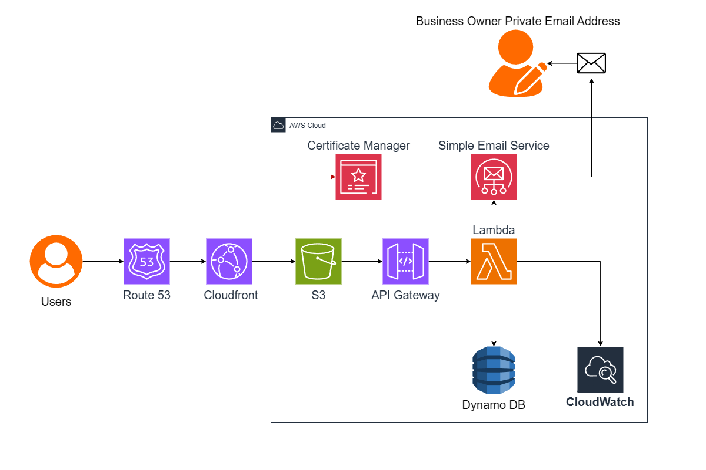

# Serverless Lead Capture on AWS: The Epic Books
I built a system on AWS that allows businesses to collect customer names and email addresses through a website. The information is stored securely for future marketing campaigns, and customers receive downloadable content via email as a reward.

## 1. Project Overview
Epic Books is a mock company that needs a simple way to collect customer names and email addresses through their website. Older setups often relied on dedicated servers that require ongoing maintenance, manual updates, and management of infrastructure. These systems can also struggle when there is a lot of traffic and are also very expensive to operate even when usage is low. The business needed a solution that could reliably keep customer data, remain fast for global users, and securely store the data without requiring dedicated infrastructure.

To solve this, I built a **serverless solution on AWS**. This eliminates the need to manage servers, which reduces infrastructure costs and also eliminates the need to hire staff for maintenance (patching). The solution automatically scales as website traffic increases and provides stronger security because it uses AWS managed services instead of vulnerable self-hosted systems.

---

## 2. Business Requirements
Epic Books provided the following requirements:

- They need a static website built with HTML, CSS, and JavaScript.  
- Customers must be able to download an ebook. 
- Customers must receive an email notification after downloading the ebook. 
- Customer details (name and email) must be stored in a database after download.
- The website must serve global users and remain fast and responsive. 
- The website has 500 active users with 10–15 ebook downloads per day.  
- All traffic must use HTTPS  
- The domain name must be theepicbooks.com.

---

## 3. Well-Architected Framework Considerations
I designed the solution using the AWS Well-Architected Framework in mind. The following pillars are the ones that  I felt are most relevant to the business’s needs:

- **Security:** HTTPS, secure storage of customer data
- **Performance Efficiency:** The website should be fast for global users
- **Operational Excellence:** Email notifications, monitoring and logging
- **Cost Optimization:** Stick to serverless services as much as possible to reduce idle costs (Cloud services that only cost money when they’re actually being used)
- **Reliability:** The database should not lose data and should also scale automatically

**Prioritized pillars for design decisions:**

1. Security
2. Cost Optimization
3. Performance Efficiency

These pillars guided all my choices. It’s also worth mentioning that these priorities might be switched and modified based on business requirements.

---

## 4. Architecture Overview

### 4.1 Architecture Diagram
 

### 4.2 How It Works (Summary)
- Static website hosted on **Amazon S3**  
- Distributed globally via **Amazon CloudFront**  
- HTTPS provided by **AWS Certificate Manager**  
- Form submissions sent to **Amazon API Gateway**  
- All processing done by **AWS Lambda**  
- Customer data stored in **Amazon DynamoDB**  
- Confirmation emails sent via **Amazon SES**  
- **Amazon CloudWatch** monitors and logs all backend activity  
- **IAM Roles & Policies** enforce least-privilege access  

---

## 5. Design Decisions & Implementation

### 5.1 Hosting Static Website
**Solution:** Amazon S3 + Amazon CloudFront + AWS Certificate Manager  

**Why:**  
- Amazon S3 can host static websites and has high availability and is scalable
- Amazon CloudFront improves speed and enables HTTPS  
- AWS Certificate Manager ensures secure connections  

**Instructions:**  
1. Prepare website files and code (HTML, FONTS, CSS, JavaScript, images)
2. Create an S3 bucket for static website hosting.
3. Enable the static website feature on S3 bucket.
4. Configure public access and added a bucket policy that grants users "GetObject" permissions.
5. Upload an error document for when users are unable to access the site.
6. Upload all website files to the S3 bucket.
7. Create a CloudFront distribution for the website using the S3 bucket as the origin type.
8. Request a public TLS certificate in ACM for theepicbooks.com.
9. Route traffic to the CloudFront distribution on Route 53.

---

### 5.2 Contact Form / Lead Capture
**Solution:** For this section I used Amazon API Gateway, AWS Lambda, Amazon SES, IAM Roles & Policies and Amazon CloudWatch. 

**Why:**  
- API Gateway provides a secure public URL for the website, allowing messages to be securely passed to the backend.
- AWS Lambda automates form submissions, scales with demand, and eliminates the need to manage servers.
- When a user submits a form, Amazon SES sends emails that are both reliable and cost-effective.
- IAM Roles and Policies ensure that Lambda only has the necessary permissions (sending emails, writing logs), thereby improving security.
- CloudWatch will act as our eyes and ears on the backend. It allows us to view what's going on, detect errors (including SES and Lambda issues), and track performance across the entire serverless system.
- This serverless architecture eliminates operational efforts, reduces cost, and enables your frontend to communicate safely with the backend. 

**Instructions:**  
1. Set up the SES service and create two identities (sender and receiver email addresses).
2. Create an IAM role to attach to the Lambda function, providing permissions to send emails using Amazon SES and write logs to Amazon CloudWatch.
3. Create a Lambda function that invokes the Amazon SES API to send emails.
4. Test the Lambda function.
5. Create a REST API in API Gateway to take form submissions from the website and send them to the Lambda function for processing.
6. Enabled CORS on the API Gateway to allow the website to access the API.
7. Deploy the API to a stage so it becomes live and usable by the website.
8. Simulate preflight check (optional) – Use CURL on the command line to mimic the browser’s preflight request and verify that the API allows requests from the website.
9. Run actual POST request – Use CURL on the command line to send the real form data to the API and verify that Lambda processes it correctly.
10. After running the CURL command for the actual POST request, you should be able to see the form submission details in CloudWatch logs and on your third-party email receiver.
11. Because CloudFront does not allow POST requests by default, edit the website code to point the form directly to the API Gateway endpoint, and include any necessary JavaScript or other code so the form can successfully send data to the Lambda function.
12. Invalidate CloudFront cache to ensure the updated website in S3 is served to users instead of the old cached version.

---

### 5.3 Data Storage (Customer information)
**Solution:** Amazon DynamoDB  

**Why:**  
- Scalable and reliable database for storing leads  
- Integrates easily with AWS Lambda  
- Fully managed, serverless  

**Instructions:**  
1. Create a table in DynamoDB.
2. Create an inline policy for the Lambda function to allow it to securely write data to DynamoDB.
3. Update the Lambda function code to store form submissions in the DynamoDB table.
4. Deploy the code and test.

**Ebook Delivery:**  
- How the customer will get their ebook: The ebook is stored in Amazon S3, which provides secure, scalable, and cost-effective storage. When a visitor submits the form on the website, Lambda processes the submission, saves the lead data in DynamoDB, and triggers SES to send a confirmation email. This email includes a link to download the ebook, either as a public S3 object or a pre-signed URL generated by Lambda, allowing the user to access the ebook securely and immediately. 

---

## 6. Trade-offs & Alternatives Considered

In this section, we'll look at other viable AWS alternatives.

### 6.1 Hosting Static Website
- Direct access to S3 with no CloudFront Rather than using CloudFront, users access the website using the web address that belongs to the S3 bucket.

  **Pros**
   - Removes the responsibility of managing CloudFront distributions and invalidation. When you make changes to your website, users will see them immediately, without having to wait for a cache to clear.

  **Cons** 
   - S3 buckets are limited to a particular region, causing delays for customers outside that region. This goes against the company's purpose of providing a quick and responsive website for worldwide consumers.
   - In order to get HTTPS, you would need Amazon CloudFront in front of S3 so that you can attach an SSL certificate using Certificate Manager. This goes directly against our business requirement that all traffic must use HTTPS.
   - It costs more to send data directly from S3 to the internet than to use CloudFront.
   - With this type of architecture, you would need to make your S3 bucket public. That means anyone on the internet can access your bucket directly, which poses a security risk. You lose CloudFront's Origin Access Control feature, which allows CloudFront to securely access your private S3 bucket while other users are denied access.

- Using AWS Global Accelerator instead of CloudFront With this type of architecture where traffic enters through the nearest AWS edge location and travels over AWS's private fiber to the S3 bucket and API Gateway.

  **Pros**
   - This type of setup is better at rerouting traffic when an AWS region becomes unhealthy.

  **Cons**
   - Unlike CloudFront, S3 does not cache content. As a result, it must handle every request. Each time a user requests a file, S3 counts it as a request, incurring a small cost that can add up quickly if your site receives a lot of traffic.
   - You pay a fixed hourly fee for each accelerator you own, even if no traffic passes through it.
   - In comparison to CloudFront, you pay for the public IPv4 addresses attached to your accelerators.

### 6.2 Customer Data Form Backend
- Using an Application Load Balancer (ALB) instead of API Gateway

  **Pros**
    1. A Lambda Function URL automatically creates a public HTTPS endpoint for the Lambda function. This removes the need to configure an API Gateway REST API, routes, stages, integrations, and deployments.
    2. Lambda Function URLs do not have the additional request charges associated with API Gateway. With this setup, you only pay for the Lambda execution time and requests. This works out better for sites with low traffic. 

  - **Cons**
    1. With API Gateway, many security features are available by default, but without it you need to configure more of these protections yourself.
    2. You will lose some of the default features that are available with Amazon API  Gateway. For example, there is no built-in request validation or throttling to control how many requests can be sent within a certain time period.
  
- Instead of using API Gateway, we can expose the Lambda function via a Lambda Function URL.

  - **Pros**  
    1. The Lambda Function URL automatically generates a public HTTPS endpoint for the Lambda function. This means you no longer need to configure the API Gateway REST API, routes, stages, integrations, or deployments.
    2. With Lambda Function URLs, you won't incur the additional request charges that come with API Gateway. With this setup, you just pay for Lambda execution time and requests. For small applications that have little traffic, this can lower overall expenses as compared to API Gateway.

  - **Cons** 
    1. API Gateway allows you to limit the number of requests that can be sent to your API within a given time frame. This protects the backend from unexpected spikes in traffic or abuse. Lambda Function URLs don't have this built-in throttling feature. 

- Using Amazon EC2 instead of Lambda

  - **Pros**  
    1. EC2 runs continuously, just like a traditional server. This makes it useful for applications that must run for long periods of time.

  - **Cons**   
  - 1. This scenario involves managing servers, patching, scaling, and will increase cost as compared to using Lambda. This defeats the purpose of serverless architecture.

---

## 7. Reliability & Resilience
In this project, we primarily use AWS managed services to reduce failure related to architecture. Let's see what happens if each service fails: 

### Amazon S3 (Static Website)

**Risk:** Misconfigured buckets or the accidental deletion of objects.
**Impact:** Users will receive 403 or 404 errors when trying to access the website.

**Mitigation strategy:**

- **S3 Bucket Versioning** will allow us to still have access to deleted or overwritten files using a delete marker.
- **CloudFront caching** can continue to provide previously cached content even if the S3 bucket experiences temporary problems.
- When you store objects in an **S3 bucket**, it automatically copies them in multiple availability zones in the region.

---

### Amazon CloudFront (Content Delivery)

**Risk:** Distribution misconfiguration or TLS certificate problems.  
**Impact:** Users may not be able to access the website via HTTPS.

**Mitigation strategy:**

- CloudFront uses **multiple edge locations around the world**. This helps to improve availability and speed/performance.
- **AWS Certificate Manager (ACM)** automatically renews **TLS certificates** for supported services, ensuring that customers do not see browser warnings about the site being unsafe.

---

### Amazon API Gateway (API Endpoint)

**Risk:** API setup issues or a sudden spike in traffic
**Impact:** Form submissions may fail.

**Mitigation strategy:**

- **API Gateway’s throttling feature** limits requests, which keeps the backend from being overloaded during sudden spikes in traffic.
- **CloudWatch alarms** can notify you when error rates increase. 
- API Gateway operates across many availability zones, ensuring that the API is available even if one data center fails.

---

### AWS Lambda (Backend Processing)

**Risk:** Code errors, timeouts, or concurrency limits.  
**Impact:** There might be a problems processing customer data (leads). 

**Mitigation strategy:**

- Proper timeout and memory settings ensure the Lambda function consistently completes its tasks, whether under heavy or light workloads.
- **CloudWatch logs** from Lambda help detect issues efficiently.

---

### Amazon DynamoDB (Lead Storage)

**Risk:** Capacity misconfiguration or accidental deletion.  
**Impact:** Form submissions may fail to store customer/lead data.

**Mitigation strategy:**

- DynamoDB automatically copies data across **multiple availability zones**.
- **On-demand capacity mode** automatically scales with traffic.
- If you enable **Point-in-Time Recovery** (PITR) , Amazon DynamoDB will automatically maintain a continuous backup of your table.

---

### Amazon SES (Email Delivery)

**Risk:** By default, SES only allows sending to approved addresses and limits the number of emails you can send at a time, which can prevent email delivery until these restrictions are removed. Always check your configurations before using the service. 
**Impact:** Confirmation emails may not be delivered.

**Mitigation strategy:**

- **Upgrading SES from sandbox to production mode** allows emails to be sent to any recipient and removes the initial sending restrictions. 
- **CloudWatch monitors SES email activity**, allowing you to detect and address email delivery issues swiftly. 

---

### Amazon CloudWatch (Monitoring)

**Risk:** If you do not properly configure monitoring rules or logs, your system may fail to track important events or failures.  
**Impact:** Problems may go undetected. 

**Mitigation strategy:**

- **CloudWatch alarms** notify you via email, SMS, or automated actions when error rates exceed the thresholds you have defined. 
- You can setup **log retention policies** that tell AWS how long to keep logs. By keeping logs for a set period, you can review past activity to investigate issues and find errors. 

---

## Resilience Summary

In order to lower the risk of infrastructure single points of failure, I used AWS managed services that run across different availability zones. The majority of the remaining risks come from application logic or human error.

---

## 8. Performance & Scalability
- **CloudFront improves website performance** by caching content at edge locations around the world. Updated content is served when the cache expires (TTL) or when a manual cache invalidation is performed.  
- **Lambda functions automatically scale** to handle simultaneous requests. 
- **DynamoDB automatically scales** to handle increases or decreases in traffic. It also replicates data across multiple availability zones, improving reliability, performance, and overall availability.
- **Amazon SES automatically scales** to handle increases in email sending. The service is fully managed by AWS, meaning you don’t need to maintain servers.
- All components are fully managed AWS services, allowing the system to scale without manual intervention while remaining responsive and dependable.

---

## 9. Security Considerations
- **Data Protection:** The customer data is sensitive and protected in DynamoDB. All data in DynamoDB is automatically encrypted at rest using AWS managed keys (KMS), so even if it is compromised, it will be unreadable. Data transferred to and from DynamoDB is also encrypted with HTTPS/TLS, so no one can read it or intercept it. 
- **Email  Security:** Amazon SES uses secure protocols such as TLS for messaging and HTTPS for API requests, as well as sender verification (DKIM/SPF), to ensure that emails are delivered safely and with integrity.
- **Access Control:** API Gateway and Lambda functions are protected by IAM roles, which allow just the rights required to complete their responsibilities (least privilege). 
- **Website security:** CloudFront Origin Access Control ensures the S3 bucket is private and its content is only accessible through CloudFront, preventing users from bypassing the CDN to access the bucket directly.
- **Security monitoring:** You can set up CloudWatch Alarms to trigger when odd activity occurs, such as: 
                          - A sharp increase in API errors 
                          - Changes in IAM roles or S3 bucket policies 
                          - When there is a high rate of requests being throttled. This may suggest potential abuse of the website or an attack.

---

## 10. Cost Considerations
- **Serverless Components:** Lambda, API Gateway, and DynamoDB eliminate the need for always-on servers, reducing infrastructure expenses.  
- **Pay-as-You-Go:** Services scale automatically, so expenses are based on actual consumption rather than fixed capacity. 
- **Content Delivery:** CloudFront caching decreases repeated S3 requests, lowering the cost for data transfer out of S3.  
- **Staffing and maintenance:** Fully managed services remove the need for maintenance personnel and manual patching.

---

## 11. Challenges & Lessons Learnt
- From this project, I learned that ACM requires you to own the domain in order for it to issue SSL/TLS certificates. I didn't own the domain so I encountered problems there. 
- After doing some research and reviewing the system, I discovered that I could also place AWS Web Application Firewall in front of CloudFront to boost security by filtering malicious traffic before it reaches the application.
- Amazon SQS can be used to improve our architecture in two ways: between API Gateway and Lambda, it stores incoming requests to handle traffic spikes and ensure no user submissions are lost, and between Lambda and SES, it queues email delivery tasks so that notifications and ebook links are automatically retried if SES fails. 
- Planning infrastructure while documenting at the same time is challenging.